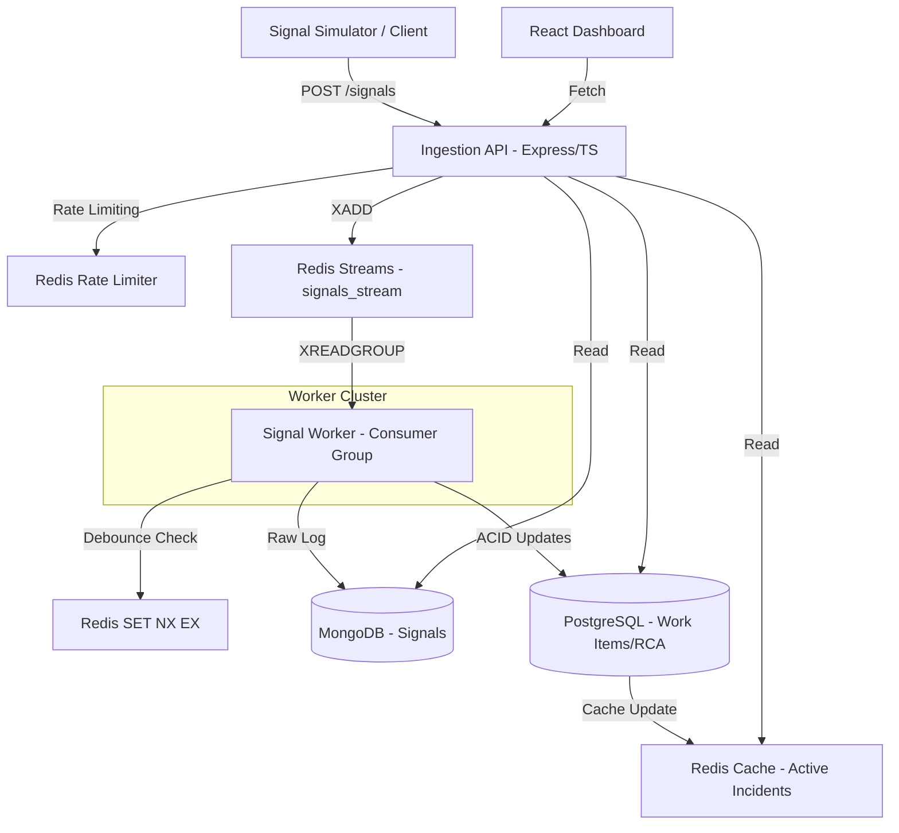

# Zeotap Incident Management System (IMS)

A production-grade, high-throughput Incident Management System designed to handle massive signal bursts, perform automated debouncing, and manage the full incident lifecycle with SRE-level resilience.

**Author**: Satya  
**GitHub Repository**: [https://github.com/Satya-0023/Zeotap-Incident-Management-System-IMS-.git](https://github.com/Satya-0023/Zeotap-Incident-Management-System-IMS-.git)

## 🚀 Quick Start (Docker)

Ensure you have **Docker** and **Docker Compose** installed.

```bash
# 1. Clone the repository
# 2. Start the entire system
docker-compose up --build

# 3. Access the dashboard
# Frontend: http://localhost:3000
# Backend API: http://localhost:3001
```

### Simulating Traffic
To test the high-throughput ingestion and debouncing logic:
```bash
cd backend
npm install
SIGNALS=5000 CONCURRENCY=50 npm run simulate
```

---

## 🏗️ Architecture



### Signal Schema
Incoming signals must follow this structure:
```json
{
  "componentId": "CACHE_CLUSTER_01",
  "componentType": "CACHE",
  "timestamp": "2026-05-01T10:00:00Z",
  "message": "Latency spike detected"
}
```

### Tech Stack Justification
- **Redis Streams**: Handles backpressure by acting as a buffer. Decouples the 10k/sec ingestion from DB processing.
- **Consumer Groups**: Enables horizontal scalability of workers and ensures **At-Least-Once** processing semantics. Idempotency and debouncing are handled at the application layer.
- **MongoDB**: Ideal as an append-only log store for high-volume raw signals.
- **PostgreSQL**: Used for work items and RCA where ACID compliance and relational integrity are mandatory.
- **State Pattern**: Ensures strictly valid transitions (e.g., cannot CLOSE without RCA).
- **Strategy Pattern**: Decouples component-to-priority mapping, making the alerting system pluggable.

---

## 🛡️ SRE & Resilience Features

### 1. Backpressure & Scalability
- **Buffering**: Redis Streams acts as a high-speed buffer for bursts (10k signals/sec).
- **Decoupling**: Producers (API) are fully decoupled from Consumers (Workers).
- **Horizontal Scaling**: The worker layer can be horizontally scaled using Redis Consumer Groups to handle increased load.
- **Controlled Throughput**: Workers process messages at a stable, controlled rate, preventing downstream database saturation.
- **Entry Protection**: Redis-based rate limiting prevents system overload at the ingestion point.

### 2. Failure Handling & Resilience
**Scenario: PostgreSQL Temporary Unavailability**
- **Persistence**: Signals remain safely stored in the Redis Stream.
- **Retry Logic**: Workers employ exponential backoff (200ms → 400ms → 800ms) to re-attempt PostgreSQL writes.
- **Zero Data Loss**: No signals are acknowledged (`XACK`) or removed from the queue until successfully persisted in all data stores.

### 3. Concurrency & Logic
- **Atomic Debouncing**: Uses Redis `SET key value NX EX 10`. Only one worker can "win" the 10-second window for a specific component.
- **Optimistic Locking**: PostgreSQL `WorkItem` model uses a `version` column to prevent lost updates during concurrent state transitions.
- **RCA Constraint**: Incident status cannot transition to `CLOSED` unless a valid Root Cause Analysis (RCA) is submitted.
- **MTTR Calculation**: Mean Time to Resolve (MTTR) is automatically computed as: `MTTR = RCA_Submission_Time - First_Signal_Timestamp`.

### 4. Observability
- **Health Endpoint**: `/health` validates active connectivity to Redis, MongoDB, and PostgreSQL.
- **Metrics Endpoint**: `/metrics` provides real-time aggregations (Signals/min via MongoDB, Severity distribution via PostgreSQL).

---

---

## 📊 API Documentation

### Ingestion
- `POST /signals`: Send raw signal data.
  ```json
  {
    "componentId": "POSTGRES_01",
    "componentType": "RDBMS",
    "message": "Connection timeout",
    "timestamp": "2026-05-01T12:00:00Z"
  }
  ```

### Management
- `GET /incidents`: List active incidents.
- `PATCH /incidents/:id/status`: Update state (OPEN, INVESTIGATING, RESOLVED, CLOSED).
- `POST /incidents/:id/rca`: Submit RCA data.

### Observability
- `GET /health`: Connectivity check for all DBs.
- `GET /metrics`: Returns signals per minute and severity distribution.

---
